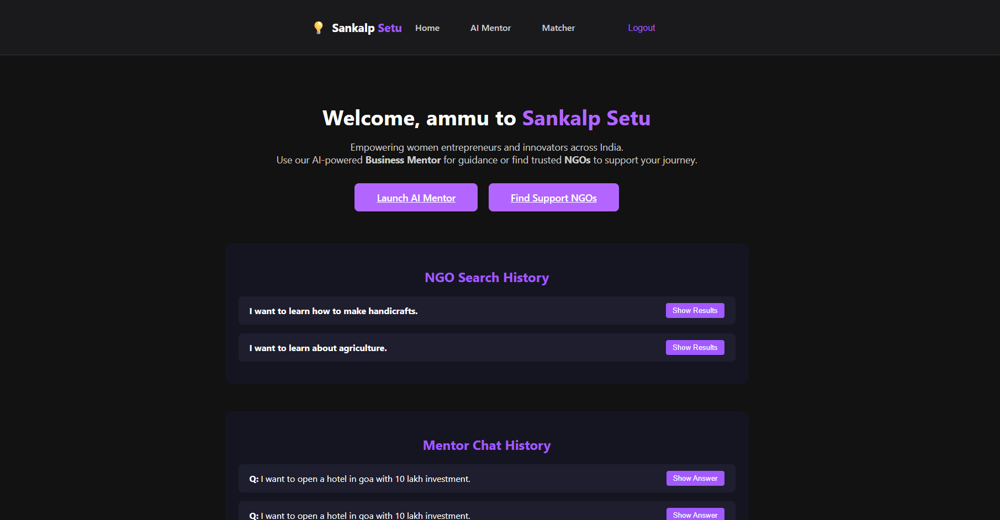

# Sankalp‑Setu: AI Mentor & NGO Matcher

Sankalp‑Setu bridges the gap between **citizen intentions** and **NGO impact** through AI.

This Django-powered platform includes two smart, language-flexible tools:
- **AI Mentor** – A multilingual Gemini-based business & NGO chatbot.
- **NGO Matcher** – A cosine-similarity matcher for finding relevant NGOs.

---

## Key Features

1- **Multilingual Support** – Accepts input in Hindi, English, Tamil, Spanish, and more.  
2- **Language Detection** – Uses `langdetect` to auto-detect user language.  
3- **Gemini AI Mentor** – Extracts structured insights and provides personalized startup plans.  
4- **NGO Matching** – Computes TF-IDF embeddings and ranks matches using cosine similarity.  
5- **Voice I/O** – (Optional) Supports speech-to-text input and text-to-speech output.  
6- **Beautiful UI** – Dark-themed modern frontend built with inline styles.

---

## Screenshots

### Home Page


### AI Mentor (Input/Output in Hindi)


### NGO Matcher (Input in Hindi)


---

## Setup & Isolation Instructions

### 1. Clone Repo
```bash
git clone https://github.com/Lalwaniamisha789/Sankalp-Setu.git
cd Sankalp-Setu
```

### 2. Create Virtualenv & Install dependencies
```bash
python3 -m venv venv
source venv/bin/activate
pip install -r requirements.txt
```

### 3. Apply migratuions and run Django Server
```bash
python manage.py migrate
python manage.py runserver
```
### 4. Access the matcher and mentor frontends:
   - Matcher: http://localhost:8000/matcher/frontend/
   - Mentor: http://localhost:8000/mentor/frontend/

## Tech Stack 
| Layer       | Tech Used                              |
| ----------- | -------------------------------------- |
| Backend     | Django 5, Django REST Framework        |
| LLMs        | Gemini (via Google Generative AI API)  |
| Translation | deep-translator, langdetect            |
| Matching    | TF-IDF + Cosine Similarity (`sklearn`) |
| Embeddings  | Sentence-Transformers: MiniLM-L6-v2    |
| Data        | NGOs (sample set in `data/`)           |
| Frontend    | HTML5 + Inline CSS (Dark Theme)        |


## License
This project is licensed under the MIT License. See LICENSE for details.

## Contributor 
Made with by 🩷🩷 Amisha Lalwani 🩷🩷.
