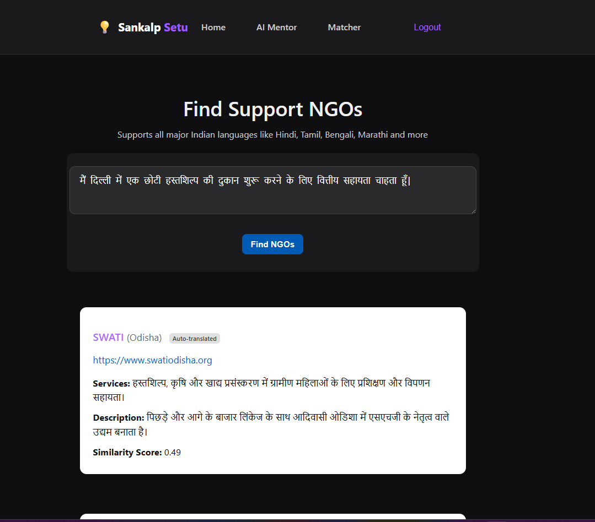

# Sankalp‑Setu: AI Mentor & NGO Matcher

## Overview
Sankalp‑Setu includes two AI‑powered modules integrated into a Django backend:
1. **AI Mentor** – a **Gemini-powered**, voice-enabled guide for NGO-related queries.  
2. **NGO Matcher** – an intelligent NGO recommendation system using cosine similarity.

Both modules support input/output in any language.

---

## Features
- **Multilingual Support**: Automatically detects the user's language, processes queries in English using AI, and returns results in the original language.
- **AI Mentor (Gemini)**:
  - Offers guidance, Q&A, and mentorship on NGO, volunteering, and social impact topics.
  - Supports **voice input and output**, replying in the user’s native language.
- **NGO Matcher**:
  - Matches user interests (via text or translated voice) to NGO profiles.
  - Uses **TF‑IDF** vectorization and **cosine similarity** to recommend best-fit NGOs.
    
---

## Screenshots

### AI Mentor
  
  
  

### NGO Matcher
  

### Home page


---

## Setup & Isolation Instructions

### 1. Clone Repo
```bash
git clone https://github.com/Lalwaniamisha789/Sankalp-Setu.git
cd Sankalp-Setu
```

### 2. Create Virtualenv & Install
```bash
python3 -m venv venv
source venv/bin/activate
pip install -r requirements.txt
```

### 3. Run Django Server
```bash
python manage.py migrate
python manage.py runserver
```
### 4. Access the matcher and mentor frontends:
   - Matcher: http://localhost:8000/matcher/frontend/
   - Mentor: http://localhost:8000/mentor/frontend/

## Tech Stack 
- LLMs: Gemini API (via Google)
- Embeddings: sentence-transformers (MiniLM-L6-v2)
- Similarity: scikit-learn (cosine)
- Translation: deep-translator, langdetect
- Backend: Django + Django REST Framework
Data: JSON (50 NGO entries)

## License
This project is licensed under the MIT License. See LICENSE for details.

## Contributor 
Made with by 🩷🩷 Amisha Lalwani 🩷🩷.
